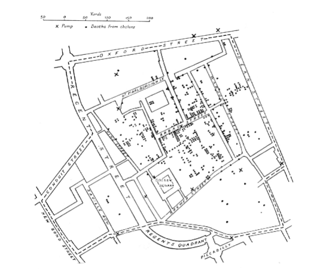
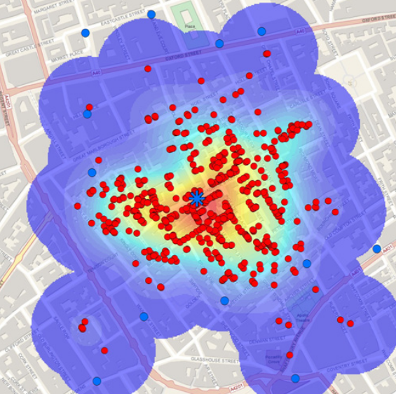
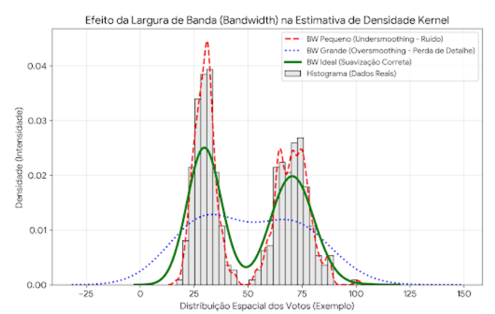
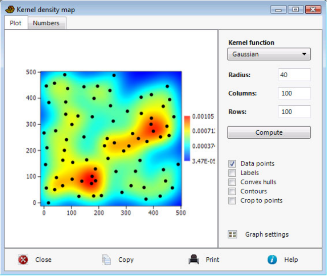

# Estimativa de Densidade Kernel (KDE)

---

## O que é a Estimativa de Densidade Kernel (KDE)

A KDE não é uma ferramenta estatística para transformar dados pontuais (discretos) em uma superfície contínua de probabilidade.

Trata-se de um método não-paramétrico (não assume uma distribuição prévia dos dados, como a normal padrão) para analisar padrões de pontos (Silverman, 1986).

O objetivo é preencher os "vazios" entre os pontos de coleta (locais de votação), estimando a probabilidade de ocorrência do fenômeno em qualquer lugar da área de estudo. É baseada no princípio de que a densidade em um ponto é influenciada pela proximidade de outros dados.

Imagine que cada local de votação é um monte de areia. Onde os montes estão próximos, eles se acumulam e formam uma montanha mais alta (maior densidade).

---

> Tudo está relacionado com tudo, mas as coisas próximas estão mais relacionadas do que as coisas distantes.  
> **Waldo R. Tobler**

---

## Histórico: o mapa de John Snow

---

## Efeitos de Primeira e Segunda Ordem

**Efeito de Primeira Ordem (Intensidade):**  
Busca estimar a intensidade média dos pontos por unidade de área (Cressie, 1993).

Onde estão os "hotspots" de votos? Onde a intensidade do voto é maior?  
Isso revela a magnitude do apoio político.

**Efeito de Segunda Ordem (Dependência Espacial):**  
Mede a interação e dependência espacial entre os eventos (Stoyan et al., 1995).

O voto em um bairro influencia o voto no bairro vizinho?  
O KDE ajuda a visualizar se o apoio é isolado (pontual) ou se existe um contágio espacial (clusters/agrupamentos regionais).

---

Para confirmar estatisticamente o efeito de segunda ordem (o "contágio" ou "efeito vizinhança"), o próximo passo seria calcular o Índice de Moran Global ou Local (LISA) sobre esses dados.  
[Aula 4!]

---

## Como funciona o Algoritmo

Ao invés de contar pontos dentro de um quadrado (como num histograma), a KDE coloca uma "função de suavização" sobre cada ponto.

Geralmente utiliza-se a Função Gaussiana (curva em forma de sino) (Scott, 1992).

O ponto central (local de votação) tem o peso máximo.  
À medida que nos afastamos do centro, o peso diminui suavemente até chegar a zero.

A soma de todas essas pequenas "curvas em sino" cria a superfície suave do mapa final.

---

## Largura de Banda (Bandwidth)

A largura de banda (h) determina o raio de influência de cada ponto.

**Raio Pequeno (Undersmoothing):**  
Captura muitos detalhes e variações locais, mas pode gerar "ruído".  
Pode ser ideal para detectar candidatos "Paroquiais" (fortes apenas em micro-regiões específicas).

**Raio Grande (Oversmoothing):**  
Produz curvas muito suaves, generalizando a tendência (Silverman, 1986).

**Interpretação:**  
Ideal para visualizar candidatos "Universais" ou grandes tendências ideológicas na cidade.

---

## Normalização

**O Viés Populacional:**  
Um mapa de KDE simples sobre "número de votos" tende a replicar o mapa de densidade demográfica (onde tem gente, tem voto).

Para analisar a preferência política real, alteramos a variável de peso (Z).

O dado bruto (votos absolutos) mostra o volume eleitoral, ao passo que o dado normalizado mostra o percentual de votos em dado local.

Dessa forma, o ruído da densidade urbana é contornado.

---

## Fórmula para normalização

I_local = (v_ij / V_j) × 100

**Onde:**

- **I_local:** Intensidade do voto no local (Variável usada como Peso no Kernel).
- **v_ij:** Quantidade de votos nominais do candidato *i* no local de votação *j*.
- **V_j:** Total de votos válidos (para todos os vereadores) depositados no local *j*.

---

O objetivo do procedimento foi converter os valores absolutos em taxas percentuais, eliminando a distorção causada pela variabilidade do tamanho do eleitorado entre os locais de votação.

Dessa forma, é possível comparar diretamente a intensidade da preferência do eleitor em diferentes regiões.
